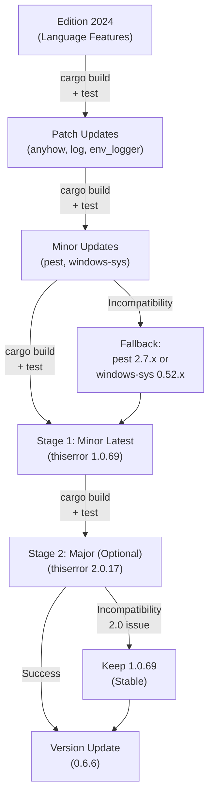
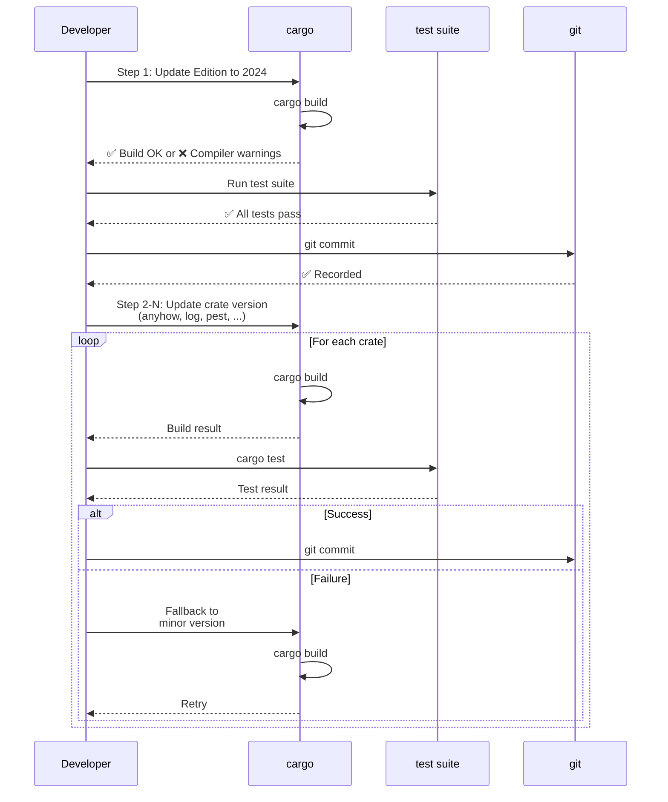

# Technical Design Document

**Feature**: upgrade-dependencies  
**Language**: ja  
**Date**: 2025-12-25

---

## Overview

このフィーチャーは、SHIORI/3.0 Rust ライブラリの依存クレートをすべて最新版にアップグレードし、Rust Edition を 2024 に移行するもの。各アップグレードは段階的な小ループ（build → test → commit）で検証し、プロジェクトバージョンを 0.6.6 に更新する。

**目的**: セキュリティ・パフォーマンス・言語機能の最新化を達成し、メンテナンス性を向上させる。

**対象ユーザー**: プロジェクトメンテナー、ライブラリ利用者（新バージョンの安定性が向上）

**影響範囲**: 
- Cargo.toml (dependencies セクション)
- Rust Edition (2021 → 2024)
- 既存コード (Windows API 互換性対応の可能性)
- テストスイート (integration test による検証)

### Goals

1. **Ambitious Target**: 各クレートの最新版への移行を目指す
2. **段階的実装**: リスク隔離により各段階での問題検出と対応を可能にする
3. **柔軟な退却戦略**: 互換性問題が解決困難な場合、マイナー版最新に自動退却
4. **完全な検証**: 各ステップで cargo build + test による動作確認

### Non-Goals

- ライブラリ API の breaking change
- 新機能の実装
- Rust version requirement の変更（MSRV は維持）

---

## Architecture

### Existing Architecture Analysis

**現在の構造**:
- `src/api.rs`: SHIORI3 プロトコルトレイト実装（log 依存）
- `src/error.rs`: エラー型定義（anyhow, thiserror 依存）
- `src/hglobal/`: Windows HGLOBAL ラッパー（windows-sys 依存）
- `src/parsers/`: SHIORI リクエストパーサー（pest, pest_derive 依存）

**依存関係パターン**:
```
src/
├─ api.rs (log::*)
├─ error.rs (anyhow::Result, thiserror::Error)
├─ hglobal/ (windows-sys::Win32::*)
└─ parsers/ (pest::Parser, pest_derive)
```

**保持すべきパターン**:
- モジュール独立性：各モジュールは独立した依存関係を持ち、相互依存は少ない
- Unsafe ブロック限定：windows-sys への unsafe 呼び出しは hglobal/ に集約
- Type safety: Result/Option による explicit error handling

### Architecture Pattern & Boundary Map

**パターン**: Staged Dependency Upgrade with Two-Stage Major Version



**責任分離**:
- **Edition 変更**: rustc による言語機能サポート（Cargo.toml のみ）
- **パッチ版アップグレード**: API 互換性が確実なアップグレード
- **マイナー版アップグレード**: 互換性検証が必須（parser logic, Win32 API)
- **段階的メジャー版移行**: マイナー版最新 (1.0.69) → メジャー版 (2.0.17) の 2-stage でリスク分離

**境界の明確性**:
- 各クレートの更新は独立（Cargo.toml での指定）
- テスト検証は統合テスト (test_data/) で実施
- Windows-specific コードは cfg(windows) ガード下で確認

---

## Technology Stack & Alignment

| Layer                  | Component    | Current | Target  | Role                | Risk |
| ---------------------- | ------------ | ------- | ------- | ------------------- | ---- |
| **Language Runtime**   | Rust Edition | 2021    | 2024    | 言語機能の最新化    | 🟢 低 |
| **Error Handling**     | anyhow       | 1.0.75  | 1.0.100 | Result wrapper      | 🟢 低 |
| **Error Definition**   | thiserror    | 1.0.51  | 2.0.17† | Error derive macro  | 🟡 中 |
| **Logging**            | log          | 0.4.20  | 0.4.29  | Log macros          | 🟢 低 |
| **Log Initialization** | env_logger   | 0.10.1  | 0.11.8  | Dev logging setup   | 🟢 低 |
| **Parsing**            | pest         | 2.7.5   | 2.8.4   | SHIORI parser gen   | 🟡 中 |
| **Parsing Macros**     | pest_derive  | 2.7.5   | 2.8.4   | Parser macro derive | 🟡 中 |
| **Win32 API Binding**  | windows-sys  | 0.52.0  | 0.61.2  | HGLOBAL, encoding   | 🟡 中 |

**†thiserror**: メジャー版 (2.0.17) または パッチ版 (1.0.69) の選択あり

### Steering Compliance

✅ **Type Safety**: 既存の unsafe ブロック (windows-sys) は hglobal/ に集約。アップグレード後も維持。  
✅ **Module Independence**: 各モジュール（api, error, hglobal, parsers）の独立性は変わらず。  
✅ **Testing**: 既存テスト suite (test_data/ SHIORI samples) を活用した integration test 維持。

---

## Requirements Traceability

| Requirement            | Summary                                                                 | Components                                 | Validation Method              |
| ---------------------- | ----------------------------------------------------------------------- | ------------------------------------------ | ------------------------------ |
| 1 (Edition 2024)       | Cargo.toml edition 値を "2024" に変更し、コンパイル・テスト成功         | Cargo.toml                                 | `cargo build`, `cargo test`    |
| 2 (anyhow)             | 1.0.75 → 1.0.100 (パッチ版) アップグレード                              | src/error.rs, src/api.rs                   | Result 型互換性テスト          |
| 3 (log)                | 0.4.20 → 0.4.29 (パッチ版) アップグレード                               | src/api.rs                                 | Macro 互換性テスト             |
| 4 (pest/pest_derive)   | 2.7.5 → 2.8.4 (マイナー版) アップグレード、困難なら 2.7.x 最新に退却    | src/parsers/req_parser.pest, req_parser.rs | test_data/ SHIORI parse テスト |
| 5a (thiserror stage 1) | 1.0.51 → 1.0.69 (マイナー版最新) アップグレード                         | src/error.rs                               | derive macro 互換性テスト      |
| 5b (thiserror stage 2) | 1.0.69 → 2.0.17 (メジャー版) アップグレード、困難なら 1.0.69 維持       | src/error.rs                               | derive macro 2.0 互換性テスト  |
| 6 (windows-sys)        | 0.52.0 → 0.61.2 (マイナー版) アップグレード、困難なら 0.52.x 最新に退却 | src/hglobal/                               | Win32 API signature テスト     |
| 7 (env_logger)         | 0.10.1 → 0.11.8 (マイナー版) アップグレード                             | [dev-dependencies]                         | Logger init テスト             |
| 8 (Version Update)     | 0.6.6 に更新、全テスト成功                                              | Cargo.toml version                         | `cargo build`, `cargo test`    |

---

## System Flows

### Upgrade Flow (段階的アップグレード)



**フロー詳細**:
- 各ステップは独立した Cargo.toml 編集と build/test/commit サイクル
- 失敗時は即座に fallback version への変更と再検証
- すべてのテストが成功することが次ステップへの必須条件

---

## Components & Interface Contracts

### Summary Table

| Component                    | Domain           | Responsibility                   | Dependencies                     | Fallback             |
| ---------------------------- | ---------------- | -------------------------------- | -------------------------------- | -------------------- |
| **Edition 2024**             | Language         | Rust language features support   | rustc                            | なし（2021 維持）    |
| **anyhow Upgrade**           | Error Handling   | Result<T> error wrapping         | Result type                      | なし（パッチ版安定） |
| **log Upgrade**              | Logging          | Log macro interface              | log::info!, debug!, etc          | なし（パッチ版安定） |
| **pest/pest_derive Upgrade** | Parsing          | SHIORI request parser generation | req_parser.pest grammar          | 2.7.x 最新版         |
| **thiserror Upgrade**        | Error Definition | Error type derive macro          | #[derive(Error)]                 | 1.0.69 (パッチ版)    |
| **windows-sys Upgrade**      | Win32 API        | HGLOBAL & encoding APIs          | GlobalAlloc, MultiByteToWideChar | 0.52.x 最新版        |
| **env_logger Upgrade**       | Dev Logging      | Logger initialization            | Builder pattern                  | なし（dev 依存）     |
| **Version Update**           | Metadata         | Cargo.toml version bump          | Semantic versioning              | なし（0.6.6 固定）   |

### Component: Edition 2024 Migration

**Intent**: Rust language feature support の最新化

**Interface Contract**:
- **Input**: Cargo.toml edition = "2021"
- **Output**: Cargo.toml edition = "2024"
- **Pre-conditions**: 既存コードが Rust 2021 で正常コンパイル
- **Post-conditions**: Rust 2024 で正常コンパイル、既存テスト suite が成功
- **Side Effects**: Clippy lint warnings の増加の可能性

**Key Operations**:
- `cargo build` with edition = "2024"
- `cargo clippy --all` で警告確認・修正
- `cargo test` で既存テスト実行

---

### Component: Patch Version Upgrades (anyhow, log, env_logger)

**Intent**: API 互換性を保ちながらセキュリティ・パフォーマンス改善を取り込む

**Interface Contract**:
- **Input**: Cargo.toml に現在バージョン記載
- **Output**: Cargo.toml に最新パッチ版記載
- **Pre-conditions**: パッチ版は breaking change なし
- **Post-conditions**: cargo build 成功、既存テスト成功

**Key Operations**:
```toml
[dependencies]
anyhow = "1.0.100"    # 1.0.75 から
log = "0.4.29"        # 0.4.20 から
[dev-dependencies]
env_logger = "0.11.8" # 0.10.1 から
```

---

### Component: Minor Version Upgrades (pest, pest_derive, windows-sys)

**Intent**: 新機能・最適化を取り込みながら互換性検証

**Interface Contract (pest/pest_derive)**:
- **Input**: Cargo.toml pest = "2.8.4", pest_derive = "2.8.4"
- **Output**: Cargo.toml 更新 + req_parser.pest 構文確認
- **Pre-conditions**: 既存 req_parser.pest が 2.7.5 で動作
- **Post-conditions**: req_parser.pest が 2.8.4 で parse 成功、test_data/ SHIORI samples が正しく parse される
- **Fallback**: 互換性問題 → 2.7.x 最新版に変更

**Validation Points**:
- `cargo build` で req_parser.rs 生成コード確認
- `cargo test` で test_data/ SHIORI 2.1/3.0/3.1/3.2 samples のパース確認

**Interface Contract (windows-sys)**:
- **Input**: Cargo.toml windows-sys = "0.61.2"
- **Output**: Cargo.toml 更新 + hglobal/ コード動作確認
- **Pre-conditions**: 既存 hglobal/ が 0.52.0 で動作
- **Post-conditions**: HGLOBAL allocation/deallocation, encoding conversion が 0.61.2 で動作
- **Fallback**: API 互換性問題 → 0.52.x 最新版に変更

**Validation Points**:
- GlobalAlloc/GlobalFree の signature 確認
- MultiByteToWideChar/WideCharToMultiByte の動作テスト
- `cargo test` で hglobal/ unit tests 実行

---

### Component: Staged Major Version Upgrade (thiserror)

**Intent**: メジャーバージョンアップ前にマイナー版最新で段階的検証を実施し、リスクを分離

**Two-Stage Approach**:

**Stage 1: Minor Version Latest (1.0.69)**
- **Input**: Cargo.toml thiserror = "1.0.51"
- **Output**: Cargo.toml thiserror = "1.0.69"
- **Pre-conditions**: src/error.rs の #[derive(Error)] マクロが 1.0.51 で動作
- **Post-conditions**: 1.0.x 範囲での改善を取り込み、derive マクロ互換性確認
- **Rationale**: メジャー版前に同一マイナー版範囲での安定性を確保

**Stage 2: Major Version Upgrade (2.0.17)**
- **Input**: Cargo.toml thiserror = "1.0.69"
- **Output (Success)**: Cargo.toml thiserror = "2.0.17"
- **Output (Fallback)**: Cargo.toml thiserror = "1.0.69" (2.0 互換性問題で維持)
- **Pre-conditions**: Stage 1 で 1.0.69 が正常動作
- **Post-conditions**: 2.0.17 で derive マクロ互換性確認、または 1.0.69 維持で要件満たす

**Decision Criteria (Stage 2)**:
- **2.0.17 採択**: derive マクロが互換性を保つ、新機能が有用
- **1.0.69 維持**: derive マクロ syntax 変更で既存コード修正が必要、または breaking change 検出

**Validation Points (各 Stage)**:
- Error type 定義の compile check
- Error Display/Debug 実装確認
- `cargo test` で error handling テスト

**Benefits**:
- ✅ 1.0.x 範囲での改善を先に取り込み
- ✅ メジャー版アップグレード時の問題を分離
- ✅ 段階的検証でリスクを最小化

---

### Component: Version Update (0.6.6)

**Intent**: すべてのアップグレード完了後のバージョン更新

**Interface Contract**:
- **Input**: Cargo.toml version = "0.6.5"
- **Output**: Cargo.toml version = "0.6.6"
- **Pre-conditions**: すべての dependency upgrade テスト成功
- **Post-conditions**: cargo build + test が成功、git tag 記録

---

## Integration Points

### Cargo.toml Update Sequence

**Atomic Units** (各ステップで独立した Cargo.toml 編集):

1. **Edition 変更**:
   ```toml
   edition = "2024"
   ```

2. **Patch Updates** (同時に複数可能、但しテストは個別):
   ```toml
   anyhow = "1.0.100"
   log = "0.4.29"
   env_logger = "0.11.8"
   ```

3. **Minor Updates** (個別に実施・テスト):
   ```toml
   pest = "2.8.4"
   pest_derive = "2.8.4"
   windows-sys = "0.61.2"
   ```

4. **Staged Major/Minor Upgrade (thiserror)**:
   
   **Stage 4a - Minor Latest**:
   ```toml
   thiserror = "1.0.69"
   ```
   - cargo build + test で 1.0.x 範囲の改善確認
   - commit: "Upgrade thiserror to 1.0.69 (minor latest)"
   
   **Stage 4b - Major (Optional)**:
   ```toml
   thiserror = "2.0.17"
   ```
   - cargo build + test で 2.0 互換性確認
   - Success → commit: "Upgrade thiserror to 2.0.17 (major)"
   - Failure → revert to 1.0.69, commit: "Keep thiserror at 1.0.69 (stable)"

5. **Version Bump**:
   ```toml
   version = "0.6.6"
   ```

### Test Validation Points

| Update                  | Validation         | Test Case                | Expected Result                                      |
| ----------------------- | ------------------ | ------------------------ | ---------------------------------------------------- |
| Edition 2024            | Compiler warnings  | `cargo clippy --all`     | 既存警告の確認・修正                                 |
| anyhow                  | Result type        | `cargo test`             | Error wrapping 動作                                  |
| log                     | Log macros         | `cargo test`             | Log output 確認                                      |
| pest/pest_derive        | Parser generation  | `cargo test`, test_data/ | SHIORI samples parse                                 |
| **thiserror (Stage 1)** | Derive macro 1.0.x | `cargo test`             | Error type definition (1.0.69)                       |
| **thiserror (Stage 2)** | Derive macro 2.0.x | `cargo test`             | Error type definition (2.0.17) or fallback to 1.0.69 |
| windows-sys             | Win32 API          | `cargo test` hglobal/    | HGLOBAL allocation/deallocation, encoding            |
| env_logger              | Logger init        | `cargo test`             | Dev logging setup                                    |
| Version update          | Metadata           | `cargo build`            | Version reflected in binary                          |

---

## Risks & Mitigation

| Risk                               | Impact                                          | Likelihood | Mitigation                                          |
| ---------------------------------- | ----------------------------------------------- | ---------- | --------------------------------------------------- |
| **pest 2.8.4 incompatibility**     | Parser broken, SHIORI parse failure             | Medium     | test_data/ comprehensive validation, 2.7.x fallback |
| **windows-sys API change**         | Unsafe code error, memory safety issue          | Medium     | Win32 API signature mapping, 0.52.x fallback        |
| **thiserror 2.0 derive change**    | Compilation error, error type definition broken | Medium     | Derive macro compatibility test, 1.0.69 fallback    |
| **Edition 2024 compiler warning**  | Build warning, potential error                  | Low        | Clippy analysis, code adjustment                    |
| **Transitive dependency conflict** | Cargo resolution failure                        | Low        | Cargo.lock deletion, cargo update --aggressive      |

### Fallback Thresholds

**Automatic Fallback Decision**:
1. `cargo build` fails → 下位バージョンへ fallback、rebuild
2. `cargo test` fails → 下位バージョンへ fallback、retest
3. Fallback version で成功 → 要件満たす（Requirement の Acceptance Criteria 参照）

---

## Implementation Considerations

### Pre-Implementation Tasks

1. **thiserror バージョン判定資料作成**
   - derive マクロ 1.0.51 vs 2.0.17 の構文比較
   - Breaking change リスト整理
   - **Stage 2 判断基準チェックリスト**:
     - [ ] `#[error]` attribute syntax の変更有無（macro 展開結果の比較）
     - [ ] `#[source]` / `#[from]` attribute の互換性確認
     - [ ] Display/Debug trait 自動実装の動作確認
     - [ ] src/error.rs の全 error type 定義が compile pass
     - [ ] `cargo test` で error handling テストが成功
     - [ ] Breaking change が src/error.rs の修正で対応可能か判断
   - **判断基準**: 上記すべてが ✅ なら 2.0.17 採択、1つでも修正困難なら 1.0.69 維持

2. **pest 2.8.4 compatibility guide**
   - req_parser.pest 最新文法確認
   - 2.7.5 → 2.8.4 構文変更マッピング

3. **windows-sys API reference**
   - **検証対象 API リスト** (src/hglobal/ で使用):
     - [ ] `GlobalAlloc(flags: u32, bytes: usize) -> HGLOBAL` (signature 変更確認)
     - [ ] `GlobalFree(h: HGLOBAL) -> HGLOBAL` (返り値型確認)
     - [ ] `MultiByteToWideChar(CodePage, dwFlags, lpMultiByteStr, ...) -> i32` (引数型確認)
     - [ ] `WideCharToMultiByte(CodePage, dwFlags, lpWideCharStr, ...) -> i32` (引数型確認)
   - **検証手順**:
     1. 0.52.0 と 0.61.2 の windows-sys docs で上記 API の型定義を diff
     2. src/hglobal/windows_api.rs の unsafe block で使用している箇所を特定
     3. 型変更がある場合、コード修正の必要性を判断
     4. `cargo build` で compile check、`cargo test` で hglobal/ テスト実行
   - 0.52.0 → 0.61.2 changes list

4. **Edition 2024 compiler/clippy warnings**
   - rustc による 2024 edition 警告リスト
   - clippy lint changes

### Task Dependencies

**Sequential (Requirement)**:
1. Req 1 (Edition 2024)
2. Req 2, 3, 7 (Patch versions: anyhow, log, env_logger)
3. Req 4, 6 (Minor versions: pest, windows-sys)
4. **Req 5a (thiserror minor: 1.0.69)** ← 段階的アップグレード Stage 1
5. **Req 5b (thiserror major: 2.0.17 optional)** ← 段階的アップグレード Stage 2
6. Req 8 (Version 0.6.6)

**Parallelizable (Optional)**:
- Req 2, 3, 7 (Patch versions): 同時更新テスト可能（検証は個別に）

**Two-Stage thiserror Upgrade**:
- **Stage 1 必須**: 1.0.51 → 1.0.69 (マイナー版最新) で安定性確保
- **Stage 2 任意**: 1.0.69 → 2.0.17 (メジャー版) で新機能検証、困難なら 1.0.69 維持
- **利点**: メジャー版アップグレード時の問題を分離、リスク最小化

---

## References & Resources

- [Rust Edition 2024 Guide](https://doc.rust-lang.org/edition-guide/)
- [pest releases & changelog](https://github.com/pest-parser/pest/releases)
- [windows-sys releases](https://github.com/microsoft/windows-rs/releases)
- [thiserror v2.0 migration](https://github.com/dtolnay/thiserror)
- [anyhow API docs](https://docs.rs/anyhow)
- [log crate docs](https://docs.rs/log)
- [env_logger docs](https://docs.rs/env_logger)
- Project research.md: `.kiro/specs/upgrade-dependencies/research.md`
